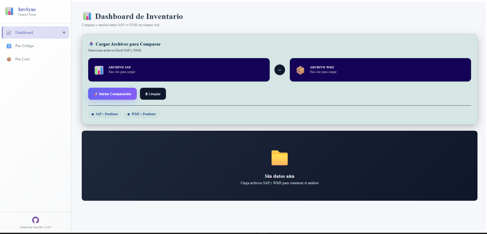
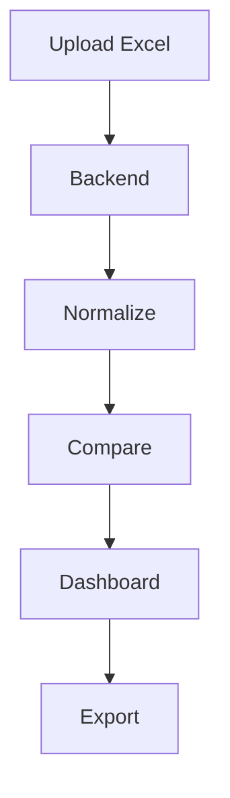

# 📦 Comparador SAP vs WMS

<p align="center">


</p>

---

<p align="center">
  
</p>

---

# 🚀 Descripción

Sistema Fullstack para conciliación y comparación de inventarios entre SAP y WMS mediante carga de archivos Excel.

Permite:

- 📊 Comparar inventarios
- 📈 Visualizar KPIs
- 📂 Exportar resultados
- ⚡ Procesar archivos masivos
- 🔍 Detectar diferencias automáticamente

---

# 🖼️ Vista Previa

<p align="center">
  
</p>

---

# 🏗️ Arquitectura

```text
┌──────────────┐
│   Frontend   │
│ React + Vite │
└──────┬───────┘
       │ HTTP API
       ▼
┌──────────────┐
│   Backend    │
│ Node + API   │
└──────┬───────┘
       │
       ▼
┌──────────────┐
│ Excel Parser │
│ Normalizer   │
│ Comparator   │
└──────────────┘
```

---

# ✨ Funcionalidades

| Función | Descripción |
|---|---|
| 📂 Carga Excel | Importación SAP/WMS |
| 🔄 Normalización | Limpieza automática |
| 📊 KPIs | Métricas visuales |
| 📤 Exportación | Descarga Excel |
| ⚠️ Diferencias | Comparación inteligente |

---

# 🛠️ Stack Tecnológico

## Frontend

- React 18
- Vite
- Context API
- CSS Modules

## Backend

- Node.js
- Express
- Multer
- XLSX

---

# 📸 Screenshots

## Dashboard


---

## Comparación por Lotes


---

# ⚙️ Instalación

## Backend

```bash
cd backend
npm install
npm run dev
```

## Frontend

```bash
cd frontend
npm install
npm run dev
```

---

# 🔌 API

## POST `/api/compare`

Compara archivos SAP vs WMS.

### Request

- fileSap
- fileWms

### Response

```json
{
  "success": true,
  "summary": {
    "ok": 120,
    "diferencias": 15
  }
}
```

---

# 📈 Flujo del Sistema



---

# ☁️ Despliegue

Compatible con:

- Render
- Railway
- Docker
- VPS Linux

---

# 🔒 Seguridad

- Archivos temporales
- Limpieza automática
- Sin persistencia sensible

---

# 👨‍💻 Autor

José Carlos Cardenas Vallejos
